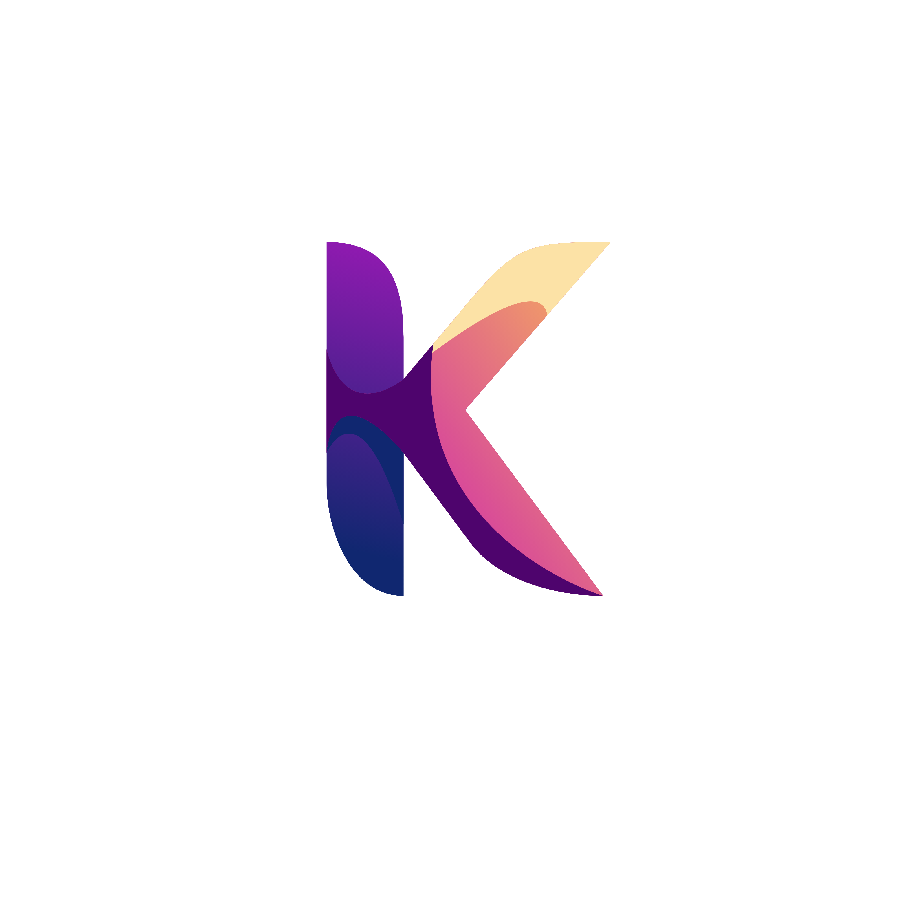

# NewsK: Personalized News Recommendation Platform 🗰


NewsK is an innovative News-as-a-Service (NaaS) platform designed to address information overload, particularly for bilingual individuals and businesses in the GCC region. By leveraging advanced machine learning (ML) and natural language processing (NLP) technologies, NewsK delivers personalized, multilingual news recommendations tailored to user preferences.

---

## Features

- **Bilingual Support**: Seamlessly integrates English and Arabic content with contextual recommendations and summaries.
- **Hybrid Recommendation Engine**: Combines content-based and collaborative filtering for precise and relevant news suggestions.
- **Multilingual Summarization**: Generates concise summaries using mT5 for Arabic and LLMs like GPT-3 for English.
- **User-Centric Design**: Responsive and intuitive interface for topic selection, viewing summaries, and accessing full articles.
- **Real-Time Monitoring**: Tracks user behavior to adapt recommendations dynamically and reduce decision fatigue.

---

## Solution Overview

NewsK employs a robust architecture that integrates:

- **Data Ingestion and Preprocessing**: Extracts and processes data from the MIND and SaudiNewsNet datasets, ensuring high-quality, structured inputs.
- **Transformer-Based Models**: Utilizes AraBERT, mT5, and Llama3 for embeddings and summarizations.
- **Scalable Deployment**: Leverages Docker and Kubernetes for efficient scaling, with MLflow and Prometheus for performance monitoring.

---

## How It Works

1. **Data Processing**:
   - Data from MIND and SaudiNewsNet is cleaned, tokenized, and stored in MongoDB.
   - NLP techniques like TF-IDF and vectorization create numerical embeddings for similarity analysis.

2. **Recommendation Engine**:
   - Hybrid approach leveraging user interaction data (collaborative filtering) and article content analysis (content-based filtering).
   - Handles cold-start challenges with fallback mechanisms.

3. **User Interface**:
   - Developed with Flask and Bootstrap.js for dynamic, mobile-friendly access.
   - Features for category selection, news recommendations, and feedback integration.

4. **Continuous Improvement**:
   - Incorporates user feedback to retrain models and adapt to evolving preferences and trends.

---

## Installation

### Steps to Run Locally:

1. Clone the Repository:
   ```bash
   git clone https://github.com/your-repo/NewsK.git
   ```

2. Navigate to the Directory:
   ```bash
   cd NewsK
   ```

3. Install Dependencies:
   ```bash
   pip install -r requirements.txt
   ```

4. Launch the Application:
   ```bash
   python app.py
   ```

---

## Datasets

- **Microsoft News Dataset (MIND)**: Over 50,000 impression logs capturing user interactions with English news.
- **SaudiNewsNet**: Features 31,030 Arabic articles with metadata and full-text content.

---

## Technology Stack

- **Backend**: Flask
- **Frontend**: Bootstrap.js
- **Database**: MongoDB
- **Models**: GPT-3, AraBERT, mT5, DistilBERT
- **Deployment**: Docker, Kubernetes
- **Monitoring**: MLflow, Prometheus

---

## Marketing Strategy

- **Target Audience**:
  - Bilingual individuals consuming Arabic and English news.
  - Corporate clients requiring real-time, strategic news insights.
- **Digital Marketing**:
  - Social media engagement (LinkedIn, Twitter, Facebook).
  - SEO and SEM for enhanced visibility.
  - Content marketing through blogs, webinars, and case studies.
- **Strategic Partnerships**:
  - Collaborations with news organizations and industry influencers.
  - Participation in conferences and events.

---

## Future Enhancements

1. **Real-Time News Updates**: Integration with APIs and RSS feeds.
2. **Expanded Language Support**: Add support for additional languages.
3. **Enhanced Data Privacy**: Role-based access controls and regular audits for GDPR and PDPL compliance.
4. **Advanced Analytics**: Improved user behavior tracking for smarter recommendations.

---

## Ethical Commitment

NewsK prioritizes ethical AI usage and data privacy:
- Complies with GDPR and PDPL regulations.
- Ensures fairness in content delivery.
- Promotes sustainability with efficient data practices.

---

## Conclusion

NewsK represents a state-of-the-art solution for personalized, bilingual news consumption. It empowers users and businesses to make informed decisions by reducing cognitive overload and delivering precise, relevant news recommendations. With its robust architecture, scalable deployment, and ethical commitment, NewsK sets a new standard for news recommendation platforms.
